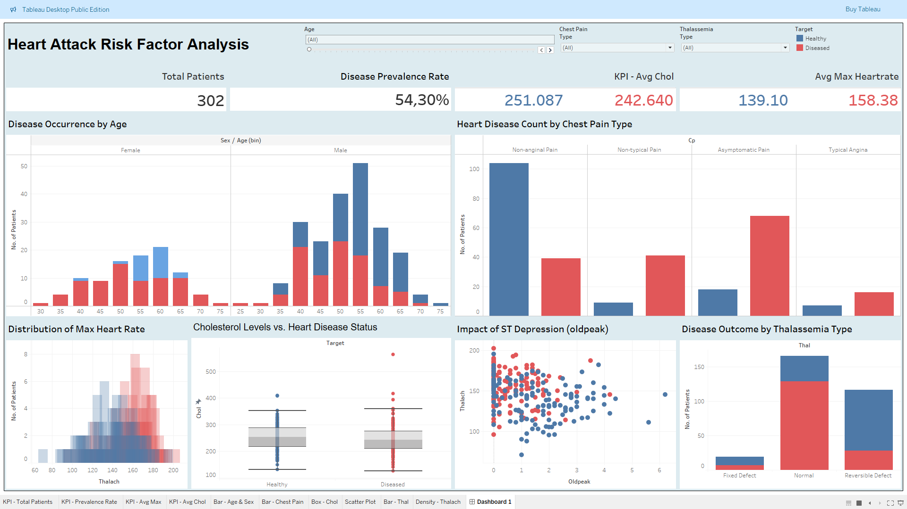

 # Heart Attack Prediction Analysis

## Project Overview

This project delves into a clinical dataset of 302 patients to identify the key physiological and demographic factors associated with heart disease. The primary goals were to conduct a thorough exploratory data analysis (EDA) to understand the profiles of diseased vs. healthy individuals, and to build a reliable machine learning model to predict the likelihood of a heart attack.

The analysis identified **Maximum Heart Rate (`thalach`)**, **ST Depression induced by exercise (`oldpeak`)**, and **Chest Pain Type (`cp`)** as the most significant predictors. A tuned Random Forest Classifier was developed, achieving a **Model Accuracy of 76%** and, more importantly, a **Recall of 88%** for identifying patients with heart disease, making it a potentially valuable tool for clinical decision support.

---

## Directory Structure

```
.
├── data/
│   ├── raw/
│   │   └── data.xlsx
│   └── processed/
│       └── cleaned_heart_data.csv
├── notebooks/
│   ├── 01_data_cleaning_and_eda.ipynb
│   └── 02_modeling_and_evaluation.ipynb
├── reports/
│   ├── figures/
│   │   ├── (Your generated plots like confusion_matrix.png, etc.)
│   └── Final_Heart_Attack_Report.pdf
├── tableau/
│   └── Heart_Attack_Dashboard.twbx
├── .gitignore
├── README.md
└── requirements.txt
```

---

## Data Analysis and Key Findings

The project followed a systematic approach:

1.  **Data Cleaning:** The initial dataset was inspected, revealing one duplicate row which was removed. The data was complete with no missing values.
2.  **Exploratory Data Analysis (EDA):** A comprehensive EDA was performed to uncover relationships between variables. The key insights were visualized in an interactive Tableau dashboard:
    *   **Max Heart Rate (`thalach`):** A clear separation exists between the two groups. Healthy patients consistently achieve a higher maximum heart rate.
    *   **Chest Pain Type (`cp`):** Patients presenting with "Asymptomatic" chest pain (Type 2) ironically had the highest incidence of heart disease, highlighting a critical, non-intuitive risk factor.
    *   **ST Depression (`oldpeak`):** A higher `oldpeak` value, which indicates ST depression during exercise, is strongly correlated with the presence of heart disease.

---

## Predictive Modeling

A baseline Logistic Regression model was first developed, followed by a more powerful **Tuned Random Forest Classifier** to achieve higher accuracy and better predictive performance.

*   **Final Model:** `RandomForestClassifier` (tuned with GridSearchCV)
*   **Key Performance Metrics:**
    *   **Accuracy:** 76.32%
    *   **Recall (for "Has Disease"): 88%**. This is the most critical metric in a clinical context, as the model correctly identifies 36 out of 41 patients with heart disease, minimizing the risk of false negatives.
    *   **Precision (for "Has Disease"): 73%**. When the model predicts disease, it is correct 73% of the time.

---

## Interactive Dashboard

An interactive clinical insights dashboard was built using Tableau. This tool allows for the dynamic exploration of patient data, enabling clinicians to filter by age, sex, chest pain type, and other factors to understand the specific profiles of different patient cohorts.

*(Here, you can add a screenshot of your finished Tableau dashboard!)*

 <!-- (Make sure to save a screenshot in this path) -->

---

## How to Run This Project

1.  **Clone the repository:**
    ```bash
    git clone https://github.com/Cozisoul/DataSciencePortfolio.git
    cd DataSciencePortfolio/heart_attack_prediction
    ```
2.  **Set up the environment:** It is recommended to use a virtual environment.
    ```bash
    python -m venv env
    source env/bin/activate  # On Windows, use `env\Scripts\activate`
    ```
3.  **Install the required libraries:**
    ```bash
    pip install -r requirements.txt
    ```
4.  **Run the Jupyter Notebooks:** Open and run the notebooks in the `notebooks/` directory in order:
    *   `01_data_cleaning_and_eda.ipynb`
    *   `02_modeling_and_evaluation.ipynb`
5.  **View the Dashboard:** The final interactive dashboard can be viewed by opening the `tableau/Heart_Attack_Dashboard.twbx` file with Tableau Public or Tableau Desktop.