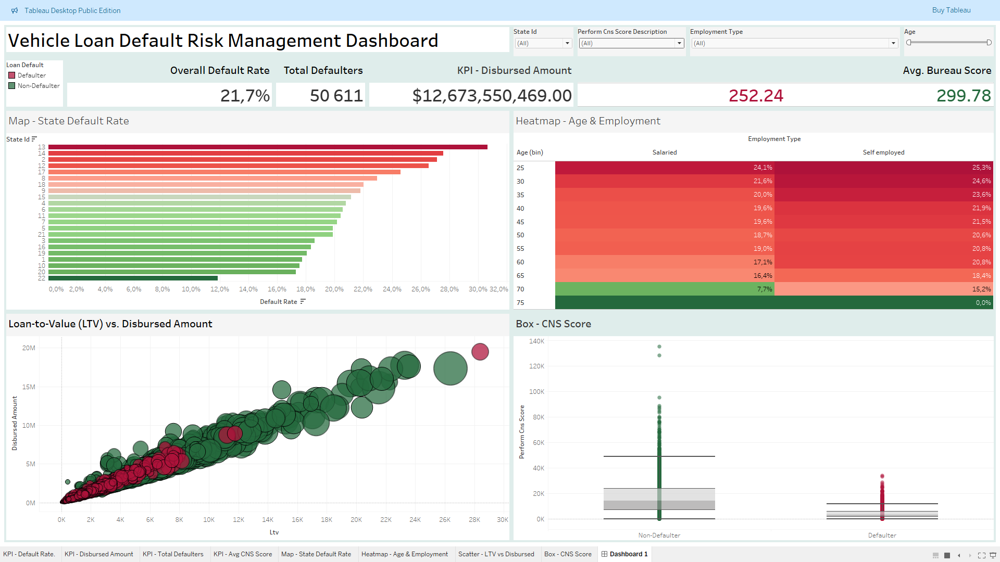

 # Predicting Vehicle Loan Defaulters

## Project Overview

This project analyzes a dataset of 233,154 vehicle loans from a financial institution to identify the key factors that contribute to loan defaults. The primary objectives are to perform a thorough exploratory data analysis (EDA) to understand the characteristics of defaulting customers and to build a predictive machine learning model to identify potential defaulters at the time of application.

The analysis reveals that factors such as a low or non-existent Credit Bureau (CNS) Score, a high Loan-to-Value (LTV) ratio, and the applicant's employment type are significant predictors of default. An interactive dashboard was developed in Tableau to visualize these risk factors, and a LightGBM (Light Gradient Boosting Machine) model was trained, which successfully identifies 66% of actual defaulters.

---

## Directory Structure

```
.
├── data/
│   ├── raw/
│   │   └── data.xlsx
│   └── processed/
│       └── cleaned_loan_data.csv
├── notebooks/
│   ├── 01_data_cleaning_and_inspection.ipynb
│   ├── 02_exploratory_data_analysis.ipynb
│   └── 03_modeling_and_evaluation_enhanced.ipynb
├── reports/
│   ├── figures/
│   │   ├── age_distribution_by_default.png
│   │   ├── confusion_matrix_lgbm.png
│   │   ├── employment_type_pie_charts.png
│   │   ├── feature_importance.png
│   │   └── id_proof_counts.png
│   └── Final_Loan_Defaulter_Report.pdf
├── tableau/
│   └── Loan_Defaulter_Dashboard.twbx
├── .gitignore
├── README.md
└── requirements.txt
```

---

## Data Analysis and Key Findings

The project followed a systematic approach:

1.  **Data Cleaning:** The initial dataset was loaded, column names were standardized, and missing values in the `Employment.Type` field were imputed using the mode.
2.  **Feature Engineering:** New, more insightful features were created, including `debt_to_asset_ratio`, flags for missing credit scores, and interaction terms, to enhance model performance.
3.  **Exploratory Data Analysis (EDA):** A deep dive into the data revealed several key insights, which are visualized in the Tableau dashboard:
    *   **High-Risk Demographics:** Younger, self-employed applicants consistently show the highest default rates.
    *   **Credit History:** A low or missing Credit Bureau (CNS) Score is one of the strongest predictors of default.
    *   **Geographic Concentration:** Risk is not uniform, with certain states showing significantly higher default rates.

---

## Predictive Modeling

A LightGBM (Light Gradient Boosting Machine) classifier was chosen for its high performance on tabular data and its ability to handle complex interactions.

*   **Model:** `LGBMClassifier`
*   **Performance:** The final model achieved a **Recall of 66%** for the "Default" class, successfully identifying a majority of high-risk applicants.
*   **Key Features:** The model identified `ltv`, `disbursed_amount`, and `perform_cns_score` as the most important predictive features.

---

## Interactive Dashboard

An interactive dashboard was built using Tableau to provide a 360-degree view of the risk factors. The dashboard allows for dynamic filtering by state, employment type, age, and CNS score, enabling risk analysts to explore and identify high-risk segments.

*(Here, you can add a screenshot of your beautiful Tableau dashboard!)*

 <!-- (Make sure to save a screenshot in this path) -->

---

## How to Run This Project

1.  **Clone the repository:**
    ```bash
    git clone https://github.com/Cozisoul/DataSciencePortfolio.git
    cd DataSciencePortfolio/loan_defaulter_prediction
    ```
2.  **Set up the environment:** It is recommended to use a virtual environment.
    ```bash
    python -m venv env
    source env/bin/activate  # On Windows, use `env\Scripts\activate`
    ```
3.  **Install the required libraries:**
    ```bash
    pip install -r requirements.txt
    ```
4.  **Run the Jupyter Notebooks:** Open and run the notebooks in the `notebooks/` directory in the following order:
    *   `01_data_cleaning_and_inspection.ipynb`
    *   `02_exploratory_data_analysis.ipynb`
    *   `03_modeling_and_evaluation_enhanced.ipynb`
5.  **View the Dashboard:** The final interactive dashboard can be viewed by opening the `tableau/Loan_Defaulter_Dashboard.twbx` file with Tableau Public or Tableau Desktop.