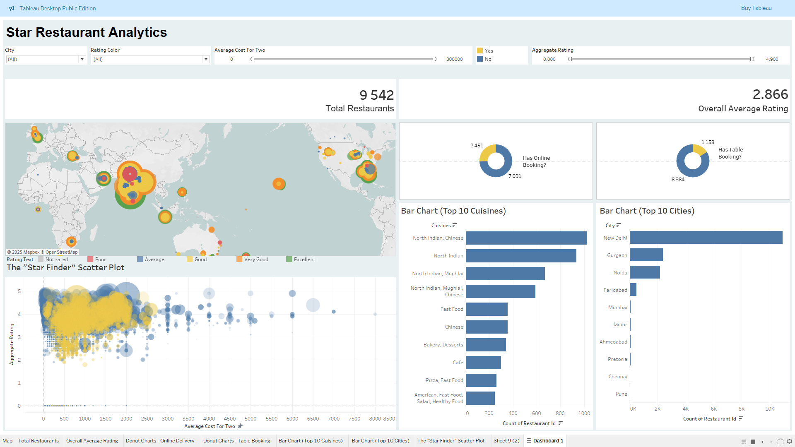

 # Restaurant "Star" Performer Analysis

## Project Overview

This project analyzes a comprehensive dataset of 9,542 restaurants to identify the key metrics that define a top-performing or "star" restaurant. The primary objective is to inform the development of an intelligent, data-driven recommendation engine for a B-to-C restaurant portal.

The analysis reveals that **customer engagement, measured by the number of 'Votes', is the most powerful predictor of a restaurant's high rating**, surpassing factors like price or specific service offerings. The project culminates in an interactive Tableau dashboard designed to empower business development and marketing teams to identify high-performing restaurants and spot strategic market opportunities.

---

## Directory Structure

```
.
├── data/
│   ├── raw/
│   │   └── data.xlsx
│   └── processed/
│       └── cleaned_restaurant_data.csv
├── notebooks/
│   ├── 01_data_cleaning_and_eda.ipynb
│   └── 02_exploratory_data_analysis.ipynb
├── reports/
│   ├── figures/
│   │   └── (Your generated plots)
│   └── Final_Restaurant_Report.pdf
├── tableau/
│   └── Restaurant_Analytics_Dashboard.twbx
├── .gitignore
├── README.md
└── requirements.txt
```

---

## Data Analysis and Key Findings

The project followed a systematic approach:

1.  **Data Cleaning:** The initial dataset was loaded and inspected. A small number of duplicate entries were identified and removed. Column names were standardized for clarity.
2.  **Exploratory Data Analysis (EDA):** A comprehensive EDA was performed to answer key business questions about the restaurant landscape. The insights were visualized in an interactive Tableau dashboard:
    *   **Customer Engagement is King:** The "Star Finder" scatter plot definitively shows that restaurants with the most votes are almost always the highest-rated, regardless of their price point.
    *   **Geographic Insights:** The map visualization highlights market saturation in cities like New Delhi, while revealing potential growth opportunities in other major metropolitan areas with lower restaurant density.
    *   **Service Offerings:** Online delivery is a standard expectation (offered by ~75% of restaurants), while table booking is a niche service (~12%), which could be used as a special filter for users.

---

## Interactive Dashboard

An interactive Business Intelligence dashboard was built using Tableau. This tool is designed for business managers to dynamically explore the data, filter by city, cuisine, and price, and use the "Star Finder" chart to identify high-potential restaurants for partnerships or promotions.

*(Here, you can add a screenshot of your finished Tableau dashboard!)*

 <!-- (Make sure to save a screenshot in this path) -->

---

## How to Run This Project

1.  **Clone the repository:**
    ```bash
    git clone https://github.com/Cozisoul/DataSciencePortfolio.git
    cd DataSciencePortfolio/restaurant_capstone
    ```
2.  **Set up the environment:** It is recommended to use a virtual environment.
    ```bash
    python -m venv env
    source env/bin/activate  # On Windows, use `env\Scripts\activate`
    ```
3.  **Install the required libraries:**
    ```bash
    pip install -r requirements.txt
    ```
4.  **Run the Jupyter Notebooks:** Open and run the notebooks in the `notebooks/` directory in order:
    *   `01_data_cleaning_and_eda.ipynb`
    *   `02_exploratory_data_analysis.ipynb`
5.  **View the Dashboard:** The final interactive dashboard can be viewed by opening the `tableau/Restaurant_Analytics_Dashboard.twbx` file with Tableau Public or Tableau Desktop.